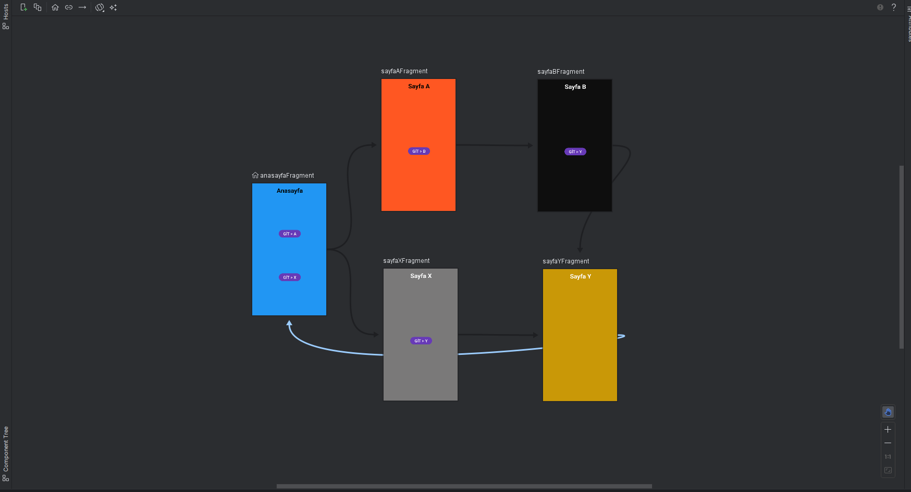

<h1>Navigation ve Fragment Kullanarak sayfalar arası geçiş </h1>

<h3>Navigation Nedir ? </h3>
<ul>
  <li>Uygulamada farklı ekranlar arasında geçiş yapmayı sağlayan bir yapıdır.</li>
</ul>

<h3>Fragment Nedir ? </h3>
<ul>
  <li>Aktivitenin bir parçası olarak kullanılan kendi yaşam döngüsüne sahip ve kendi arayüzüne sahip olan bir bileşendir.</li>
</ul>

<h3>navigation.xml Yapısı</h3>

